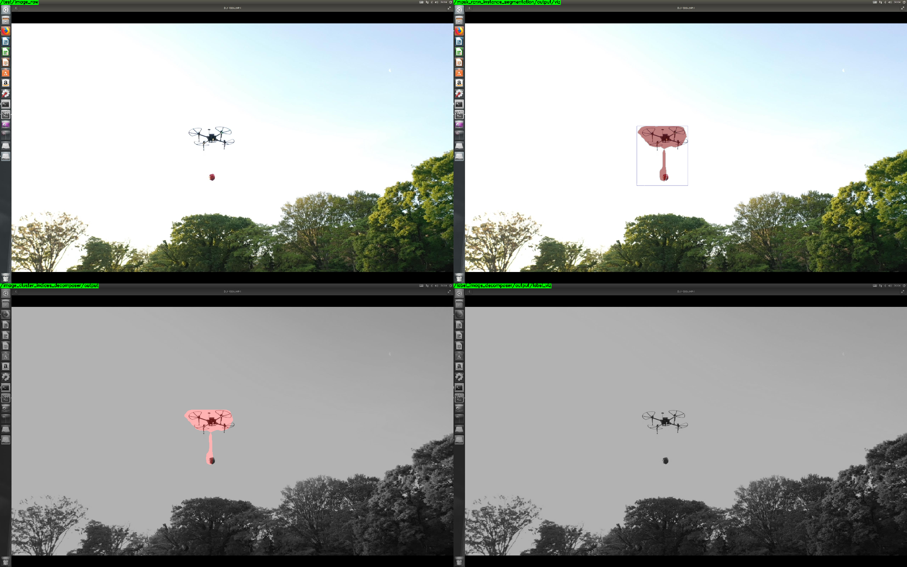
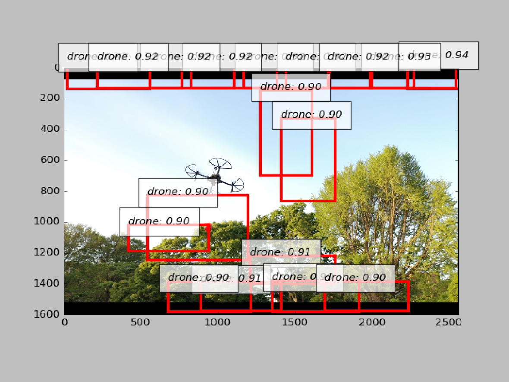

drone detection
==================================

1. Mask R-CNN
-------------

Tranining sample
^^^^^^^^^^^^^^^^
.. code-block:: bash

   rosrun jsk_perception train_mask_rcnn.py --train_dataset_dir `rospack find jsk_perception`/learning_datasets/2019-04-28-07-04-27_mask_rcnn_drone_tracking_training_data_voc --val_dataset_dir `rospack find jsk_perception`/learning_datasets/2019-04-28-07-04-27_mask_rcnn_drone_tracking_training_data_voc

Inference on static image
^^^^^^^^^^^^^^^^^^^^^^^^^

.. code-block:: bash

   roslaunch jsk_perception sample_mask_rcnn_drone_detection.launch use_static_image:=True

Inference using Video
^^^^^^^^^^^^^^^^^^^^^

.. code-block:: bash

   roslaunch jsk_perception sample_mask_rcnn_drone_detection.launch use_static_image:=False

**Note**: Please open a new image view by `rqt_image_view`

2. SSD
------

Tranining sample
^^^^^^^^^^^^^^^^

.. code-block:: bash

   rosrun jsk_perception ssd_train_dataset.py --gpu 0  --batchsize 16 --iteration 2000 -o ~/results `rospack find jsk_perception`/learning_datasets/2019-04-28-07-04-27_ssd_drone_tracking_training_data/label_names.yml  `rospack find jsk_perception`/learning_datasets/2019-04-28-07-04-27_ssd_drone_tracking_training_data

Inference on static image
^^^^^^^^^^^^^^^^^^^^^^^^^

**Note**: the current traning reuslt is not good

.. code-block:: bash

  roslaunch jsk_perception sample_ssd_drone_detection.launch

3. HSV Color Filter
-------------------

.. code-block:: bash

  roslaunch jsk_perception sample_hsv_color_filter_circle_hough_drone_detection.launch

